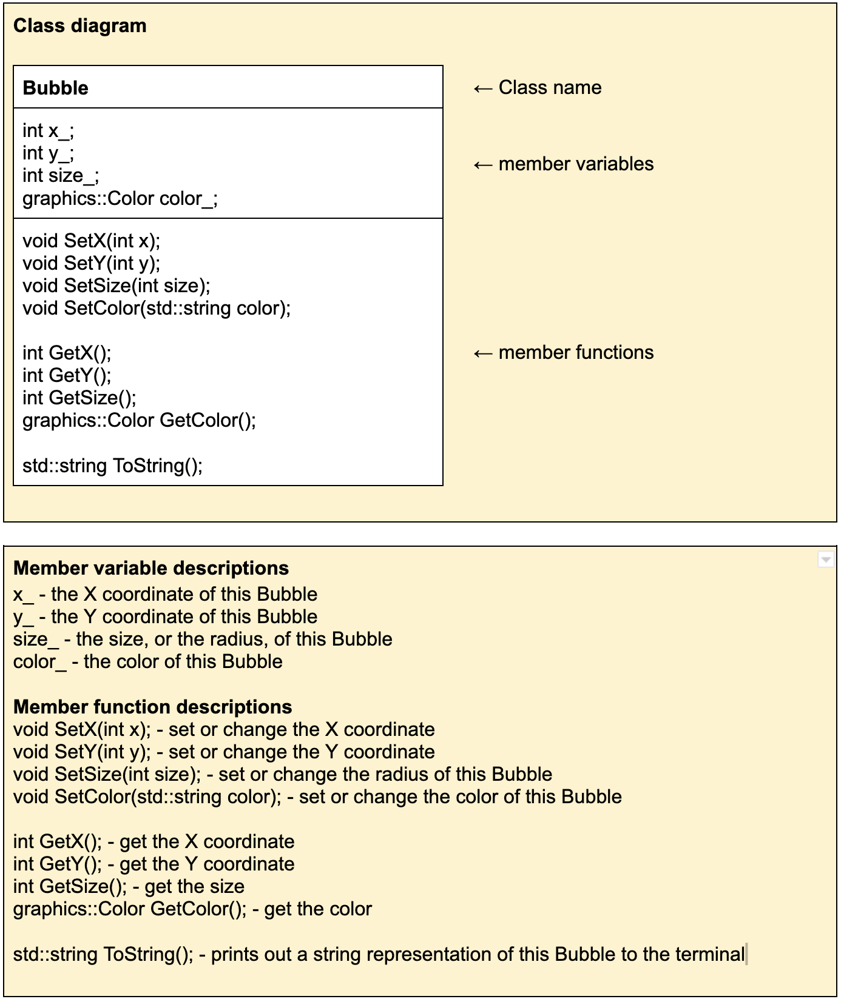

#  Colorful bubbles
In this problem, you will use the ``Bubble`` class to make images of colorful bubbles.
You will use your knowledge of classes and objects to make an instance of the ``Bubble`` class
(aka instantiate a ``Bubble``), set its member variables, and use its member functions to draw a `Bubble` into an image.

Every ``Bubble`` object has the following member variables:
* X coordinate
* Y coordinate
* Size (i.e. its radius)
* Color

To better understand the member variables and member functions contained within the`Bubble` class, you may refer to this class diagram: 

Note that no constructor is explicitly listed here. If no user-declared constructors of any kind are provided in a class, the compiler will always declare a default constructor, which is a constructor which accepts no parameters.

Note: you only need to look inside `bubble.h` (the header file) to know what member functions you may use in the `Bubble` class.
While the implementation of the `Bubble` class lives in `bubble.cc`, it's not necessary that you understand how it works in order
to use its member functions. This is the beauty of header files - you can read the function declarations in a `.h` file to use
functions without knowing how they work underneath.

##  Complete ``main.cc``

Your task is to complete ``main.cc`` to build and draw ``Bubble`` objects based on user input.
``main.cc`` already does the work to draw the Bubble as an image saved in ``bubble.bmp``. You should follow these steps:

1. First, you will need to create a ``Bubble`` object from the ``Bubble`` class.
2. Next, you must prompt the user to provide the following: an `int` for the X coordinate, an `int` for the Y coordinate, an `int` for the Bubble's size, and a `std::string` for the Bubble's color.
3. Next, you must use the user's input to set the new `Bubble` object's x and y coordinates, the size, and the color using the member functions of the `Bubble` class.
4. Finally, you can open the `bubble.bmp` file to see the bubble you've drawn. You should see a circle centered at `(x, y)` with a radius of `size`, in the given color.

##  Run the unit tests
We've provided unit tests, which you can try with ``make test``. Use the output to help you debug any issues in your program.

# Submission checklist
1. Accepted user input in the `main.cc` file.
1. Created a `Bubble` object using the default constructor.
1. Used the `Bubble` member functions to set its member variables based on the user input.
1. Compiled and ran the driver (`main.cc` file).
1. Manually checked for compilation and logical errors.
1. Ensured no errors on the unit test (`make test`).
1. Followed advice from the stylechecker (`make stylecheck`).
1. Followed advice from the formatchecker to improve code readbility (`make formatcheck`).

# Code Evaluation

If you're using Replit, you can click the "Run" button and follow the prompts to build and test your code.

Otherwise:

Use the `make build` command to compile your code and save it into an executable file called `main`.
Then you can use the `./` command to run it. Take note that if you make any changes to your code, you will need to compile it first before you see changes when running it.

```
make build
./main
```

Alternatively, you can use the `clang++` command to compile your code and the `./` command to run it. The sample code below shows how you would compile code saved in the image library, `bubble.cc`, and `main.cc`, and into the executable file `main`.

```
clang++ -std=c++17 main.cc bubble.cc cpputils/graphics/image.cc -o main -lm -lX11 -lpthread
./main
```

## Run the unit tests

We've provided unit tests, which you can try with ``make test``. Use the output to help you debug any issues in your program.
For code style, make sure you follow advice from the stylechecker using ``make stylecheck``.
For code formatting, make sure you follow advice from the formatchecker to improve code readbility using ``make formatcheck``.

You can run one, two, or all the commands below to `test` your code, `stylecheck` your code's design, or `formatcheck` your work. Kindly make sure that you have compiled and executed your code before issuing any of the commands below to avoid errors.

```
make test
make stylecheck
make formatcheck
```

A faster way of running all these tests uses the `all` parameter.

```
make all
```

# Submission
1. When everything runs correctly,  let's copy your code into the GitHub repository. The first step is to add your code to what is called the staging area using git's `add` command. The parameter after `add` is the name of the file you want to add. There are cases when you have multiple changed files, so you can just type `git add .` (period) to add all modified files.

    ```
    git add main.cc
    ```
1. Once everything is in the staging area, we use the `commit` command to tell git that we have added everything we need into the staging area.

    ```
    git commit -m "Your description here"
    ```
1. In case it asks you  to configure global variables for an email and name, just copy the commands it provides then replace the dummy text with your email and Github username.

    ```
    git config --global user.email "tuffy@csu.fullerton.edu"
    git config --global user.name "Tuffy Titan"
    ```
    When you're done, make sure you type the `git commit -m "Your description here"` command again.    
1. Lets push all changes to the Github repository using git's `push` command. Provide your Github username and personal access token when you are asked.

    ```
    git push
    ```
1. Once you push, the autograder is automatically kicked off. Check the results in the 'Actions' tab - a green check means that all tests passed.


